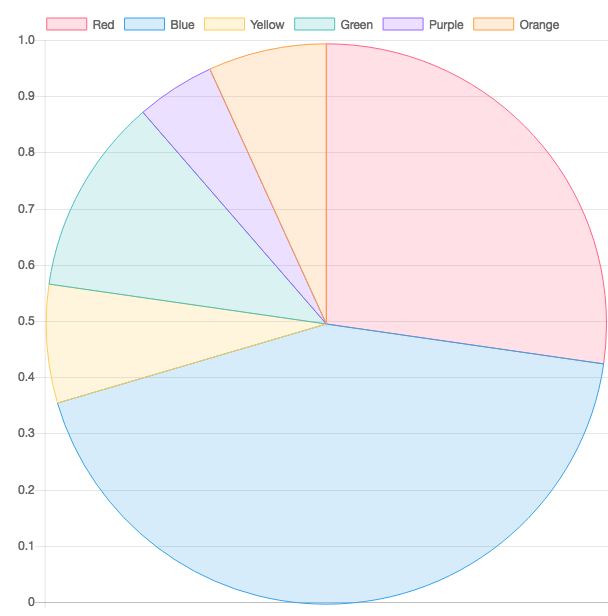

HTML To Image
============================

This simple script will convert an HTML page into an image, using PhantomJS. It accepts a few arguments to provide little flexibility.

Requirements
-------------

* Requires PhantomJS

Usage
-------------

```javascript
phantomjs render.js URL filename [viewPortWidth=(in px),viewPortHeight=(in px),imageFormat=(jpg|png),delay=(in ms)]
```

```javascript
// Create an image for http://google.com save to the current working dir as google.png
// with no predefined width and height
phantomjs render.js http://google.com google.png

// Create an image for http://google.com save to the current working dir as google.png
// with a set width and height
phantomjs render.js http://google.com google.png 600 600

// Create an image for http://google.com save to the current working dir as google.png
// with set width and height and jpeg as the output format
phantomjs render.js http://google.com google.png 600 600 jpeg

// Create an image for http://google.com save to the current working dir as google.png
// with set width and height and jpeg as the output format and a 1sec delay
phantomjs render.js http://google.com google.png 600 600 jpeg 1000

// Create an image for http://google.com save to the current working dir as google.png
// with no set width and height and jpeg as the output format
phantomjs render.js http://google.com google.png null null jpeg

```

Example Output Image of a chart created using chart.js


